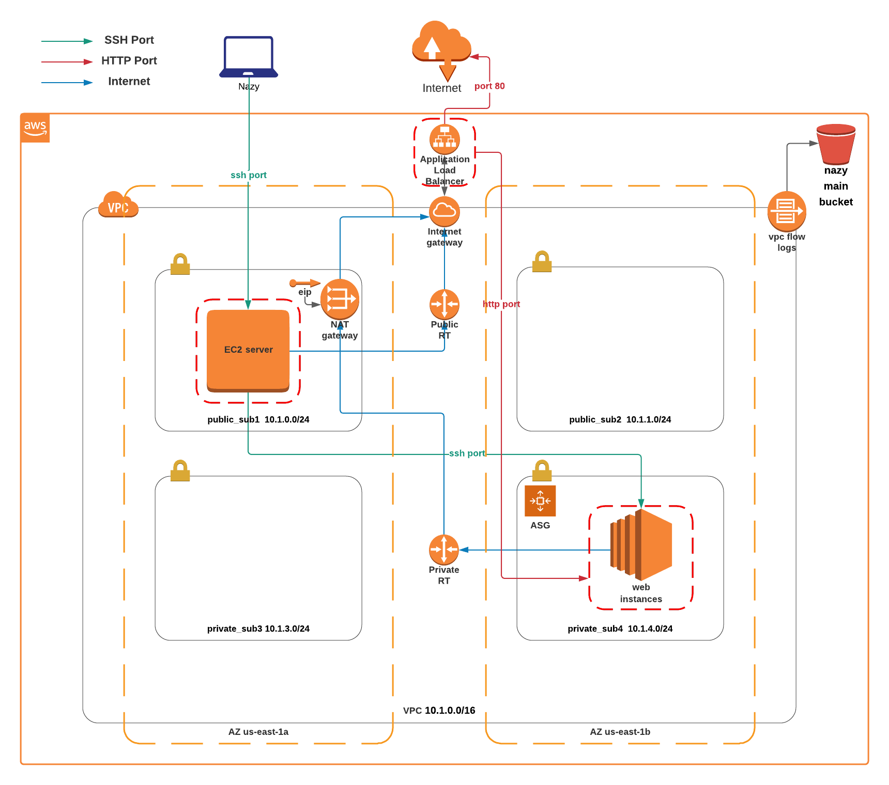
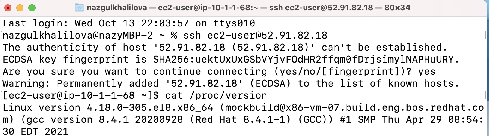
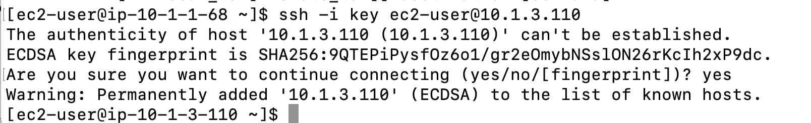
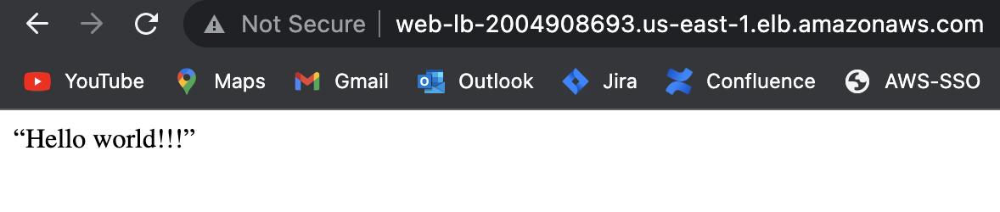

## Terraform task

### Create following resources

- 	1 VPC – 10.1.0.0/16
    - 4 subnets (spread across two availability zones for high availability)
      - Sub1 – 10.1.0.0/24 (should be accessible from internet)
      - Sub2 – 10.1.1.0/24 (should be accessible from internet)
      - Sub3 – 10.1.2.0/24 (should NOT be accessible from internet)
      - Sub4 – 10.1.3.0/24 (should NOT be accessible from internet)
-	1 compute instance running RedHat in subnet sub2
    - 20 GB storage
    - t2.micro
-	1 ASG running RedHat in subnet sub4 
    - 20 GB storage
    - Script the installation of apache on these instances
    - 2 minimum, 6 maximum hosts
    - t2.micro
-	1 alb that listens on port 80 and forwards traffic to the instance in sub4
-	Subnets should have security groups in place
-	1 S3 bucket with lifecycle policies
    - Images folder move to glacier after 90 days
    - Logs folder cleared after 90 days

### Prerequisites:
   - AWS account
   - Terraform installed v1.0.0
   - Existing SSH key

### Usage
```
git clone https://github.com/nazy67/terraform_challenge

cd /remote_state   # enter account id in variables.tf

terraform init
terraform plan
terraform apply

cd /root_module   # change variable values if needed

terraform init
terraform plan
terraform apply
```

## Diagram



### Security group configuration

  - Application Load balancer security group:
    - port 80(HTTP) open to 0.0.0.0/0
    - port 80(HTTP) open to web server security group 
  - EC2 server security group:
    - port 22(SSH) open to Webserver security group
    - port 22(SSH) open to and local laptop 
  - Webserver security group:
    - port 80(HTTP) open to ALB security group
    - port 22(SSH) open to EC2 server security group

### Screenshots

#### Login to the instance in sub1 and take a screenshot of the terminal logged in



#### SSH from ec2 server in sub1 to webserver in sub4



#### ALB dns on browser



## Useful links

- [terraform-aws-modules](https://github.com/terraform-aws-modules/terraform-aws-vpc)
- [terraform-aws-autoscaling](https://github.com/HDE/terraform-aws-autoscaling)
- [terraform-aws-alb](https://github.com/HDE/terraform-aws-alb)
- [terraform-aws-s3-bucket](https://github.com/terraform-aws-modules/terraform-aws-s3-bucket)
- [terraform-aws-ec2-instance](https://github.com/terraform-aws-modules/terraform-aws-ec2-instance)